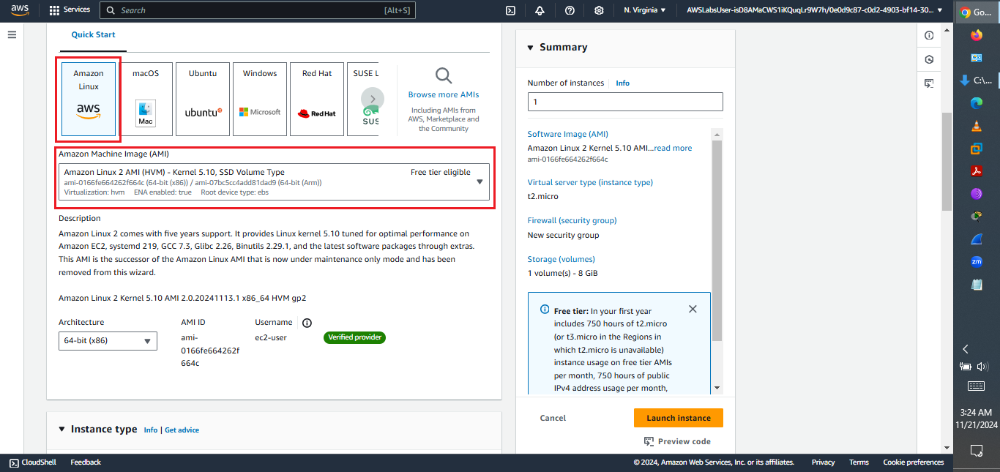
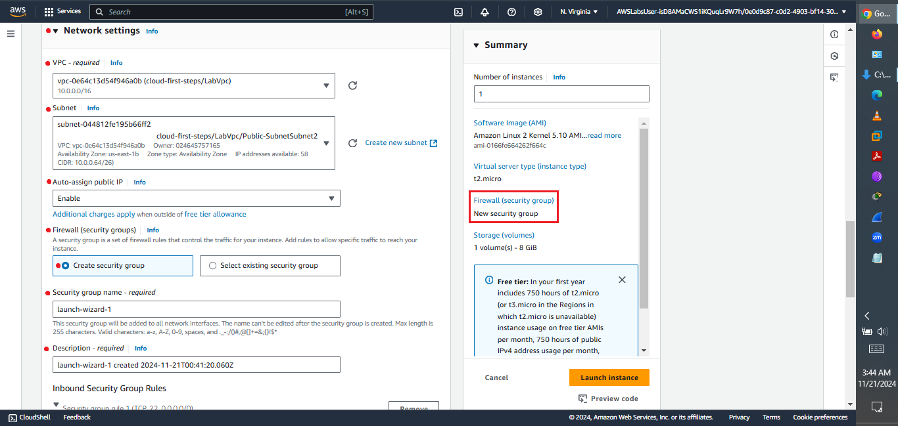
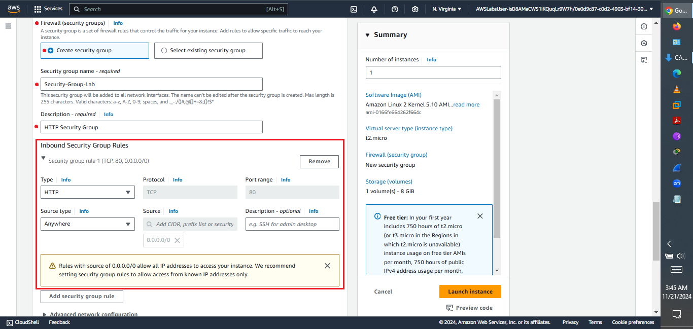
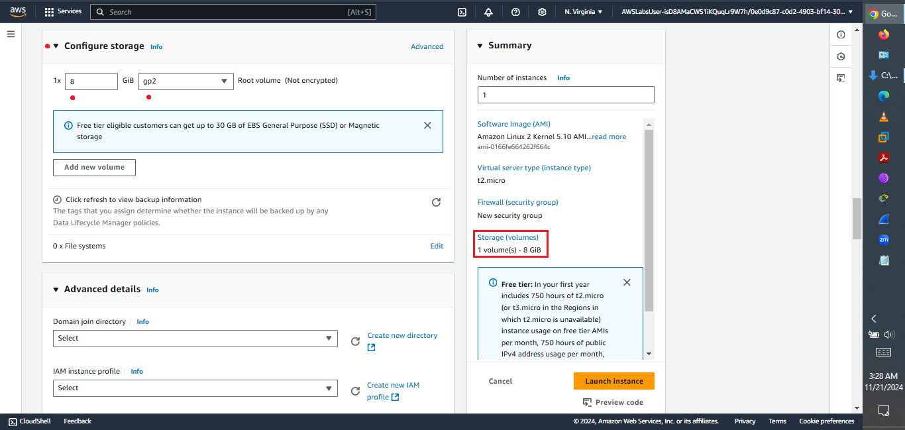

# Quest 2: Cloud First Steps – Launching My First EC2 Instance! 🚀☁️

Alright, cloud fam! You know the drill: welcome back to my digital playground, where I'm leveling up my AWS game, one sassy step at a time! ✨💅. After conquering the Cloud Computing Essentials, it was time for **Quest 2: Cloud First Steps**. This lab was all about getting hands-on with Amazon EC2 – think virtual servers, but make it *fierce*! 🥂

---

### 🎯 Quest Unlocked:

This quest was a foundational dive into deploying compute power in the cloud. My objectives for this mission included:

* Launch an Amazon EC2 instance.
* Configure a user data script to display the Instance details in a browser.

Sounds like building my own digital server, right? Let's get into it!

---

### 🛠️ AWS Services I Commanded:

For this crucial step in my cloud journey, the star of the show was:

* **Amazon EC2 (Elastic Compute Cloud):** This is where you launch your virtual servers (or "instances") in the cloud. It's the backbone for so many applications, and I got to play architect!

---

### 💅 My Journey Through the Lab (and What I Wired Up!):

Navigating the AWS Console for the first time felt a little intimidating at first, but with Quest 2, I was already feeling more like a seasoned explorer. My missions involved setting up everything from the EC2 instance itself to its security group and even a sassy user data script!

**1. Pre-Flight Check: User Data Download**
Before liftoff, the lab had me grab a `user-data` file. This little script was going to be the secret sauce for making my instance shout its details in a browser later. Always download your essentials!

 **
 *Grabbing my user-data script – the magic behind displaying instance details!*

**2. Heading to EC2 HQ:**
First things first, I ensured my region was set to N. Virginia (`us-east-1`). Then, it was straight to the services search box, typing "ec2" to find my way to the Elastic Compute Cloud dashboard.

 **
 *Always start with the right region and a quick search for my target service: EC2.*

**3. Launching My Virtual Server:**
From the EC2 Dashboard, the mission was clear: "Launch instance." Clicking that button felt like hitting the big red "GO" button – exciting times!

 **
 *The glorious "Launch instance" button! My first virtual server was calling my name.*

**4. Naming My Creation & AMI Selection:**
I gave my instance a fierce name – `webserver01`, because clarity is key! Then, it was time to pick the right Amazon Machine Image (AMI). The lab specifically guided me to choose **Amazon Linux 2 AMI (HVM)**, not the 2023 version, to avoid any launch failures. Precision is my middle name when it comes to AMIs!
  **
  *Naming my web server.*
  
  **
  *Picking the perfect AMI. Every choice matters!*

**5. Instance Type & Key Pair Choices:**
For the instance type, `t2.micro` was the go-to – free tier eligible and perfect for this lab. And for the key pair, the lab had me proceed *without* one, which is generally *not recommended* for real-world scenarios, but totally valid for a controlled lab environment. Safety first, even in virtual cities!

  **
  *`t2.micro` for efficiency, and proceeding without a key pair for the lab's purpose.*

**6. Network Naming & Security Group Sass:**
This was the juicy part – setting up the network! I chose `LabVpc` for the VPC and a subnet in `us-east-1a`. Then came the Security Group rules – my virtual firewall! I named it `Security-Group-Lab` with the description "HTTP Security Group". The most critical rule? Allowing **HTTP traffic (port 80)** from `0.0.0.0/0` (everyone!) – necessary for web access, but a security pro knows this requires refinement in real life.

  **
  *Configuring my network.*

  **
  *Setting up the HTTP Security Group – laying the groundwork for web access!*

**7. Storage & User Data Magic:**
For storage, `gp2` was the chosen root volume type. The real magic happened in the Advanced details section where I inserted the `user-data` script downloaded earlier. This script would execute when the instance launched, telling it to display its own details in a browser. Talk about self-aware servers!

  **
  *Setting up storage and injecting my user-data script. This is where the server gets its instructions!*

  **
  *Injecting my user-data script. This is where the server gets its instructions!*

**8. Launching the Instance & Verification:**
With all configurations dialed in, it was time to hit "Launch instance"! The lab then guided me to verify the instance was running and to access its public IP to see the user data script in action in a browser. Watching my server display its own details was a moment of pure cloud joy!

  **
  *My EC2 instance is live and serving its own details! Success!*

---

### 🔑 Key Takeaways & Cloud Revelations:

This lab was my first real dance with Amazon EC2, and it truly opened my eyes to the power of virtual servers in the cloud.

* **EC2 is Fundamental:** Understanding EC2 instances is absolutely crucial for building almost anything in AWS. It's the compute backbone.
* **Networking Matters:** Security Groups are your first line of defense. Setting up the right VPC and subnet is essential for instance connectivity and isolation.
* **User Data Power:** User data scripts are super handy for automating instance configuration at launch time. This is a game-changer for quick deployments.
* **Security Vigilance:** Even in a lab, it's clear that opening ports like 80 to the world (`0.0.0.0/0`) requires careful consideration in a production environment. Always practice least privilege!

---

### ✨ What's Next on My Cloud Quest:

Having successfully launched my first EC2 instance, I'm feeling even more confident about my cloud journey. My next steps involve diving deeper into networking, database services, and continually reinforcing my cloud security specialist skills. The quests continue, and so does my unyielding pursuit of cloud mastery!

---

### 🌐 Let’s Connect!

Curious about AWS Cloud Quest, cloud security, or just want to chat about making tech fierce and fun? Let’s connect!

* 💼 [My LinkedIn Profile](https://www.linkedin.com/in/mercy-ndonga/) 
* 🌍 Nairobi-based, globally curious 🌍

---

✨ Securing the cloud and serving vibes! 🥂💅☁️✨
